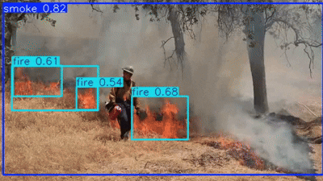
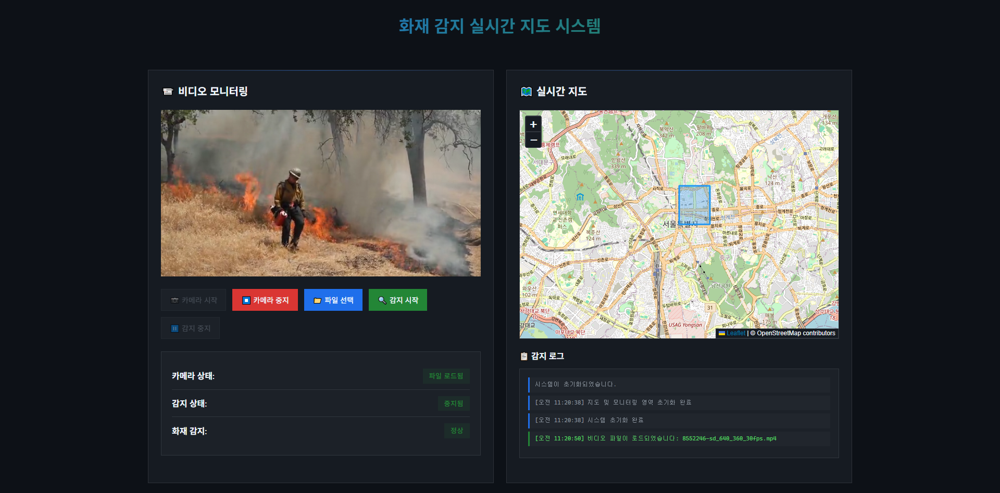
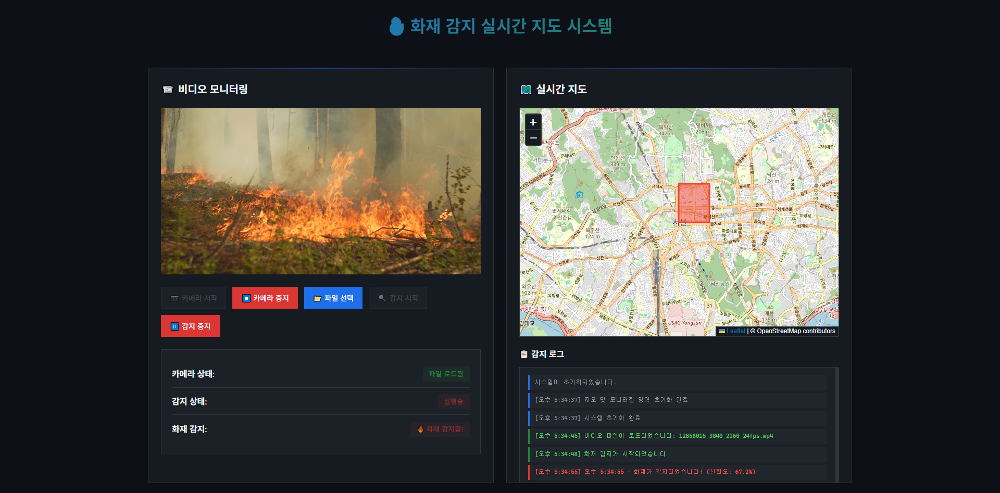

# Fire and Smoke Detection


RTMP / RTSP 기반 실시간 스트리밍 영상을 YOLOv8 기반 CNN 모델로 분석하여 불(fire)과 연기(smoke) 를 탐지하는 실시간 모니터링 프로젝트입니다.

### OverView

아래 이미지는 시스템이 불과 연기를 감지하기 전과 후의 상태를 명확하게 보여줍니다.



| 감지 전 상태 (Non-detection)                               | 감지 후 상태 (Detection)                               |
| :--------------------------------------------------------- | :------------------------------------------------------- |
|                |                |
| 화재나 연기가 감지되지 않은 **정상 상태**의 비디오 프레임입니다. | 화재 및 연기가 성공적으로 감지되어 **바운딩 박스**로 표시된 비디오 프레임입니다. |

오른쪽 이미지에서 볼 수 있듯이, YOLOv8 모델은 불꽃(`fire`)과 연기(`smoke`)를 정확히 구분하여 사각형 형태로 영역을 표시하고, 해당 객체의 클래스 이름과 신뢰도(%)를 함께 보여줍니다.

[Read Architecture](./ARCHITECTURE.md)

## Quick Start

### Prerequisites

-   Java 17 or higher
-   Python 3.8 or higher
-   Docker & Docker Compose
-   (Optional) NVIDIA GPU & CUDA for hardware acceleration

### 1. Event-Driven Pipeline 실행

#### Step 1: Kafka Broker 실행

터미널에서 `broker` 디렉토리로 이동하여 Docker Compose를 실행합니다.

```bash
cd broker
docker-compose up -d
```

#### Step 2: Preprocessor 실행

~~java 21을 사용하고 있다면 `gradle.properties`에 `org.gradle.java.installations.auto-detection=true`와 `org.gradle.java.installations.fromEnv=true`를 설정해주세요.~~
`preprocessor`는 Gradle을 사용하여 빌드하고 실행할 수 있습니다.

```bash
cd preprocessor
./gradlew bootRun
```

서버는 `localhost:8000`에서 실행됩니다.

#### Step 3: Consumer 실행

먼저, 필요한 Python 패키지를 설치합니다. `consumer` 디렉토리에서 다음을 실행하세요.

```bash
# consumer/ 디렉토리로 이동
cd consumer

# 가상환경 생성 및 활성화 (권장)
python -m venv venv
source venv/bin/activate  # macOS/Linux
# venv\Scripts\activate    # Windows

# 필요 패키지 설치
pip install ultralytics confluent-kafka pillow opencv-python torch torchvision
```

패키지 설치 후, consumer를 실행합니다.

```bash
python consumer.py
```

#### Step 4: 테스트 이미지 전송

새 터미널을 열고 `curl` 명령어를 사용하여 `preprocessor` 서버로 이미지를 전송합니다.

```bash
curl -X POST -F "file=@/path/to/your/image.jpg" http://localhost:8000/api/images/upload-process
```

`consumer.py`를 실행한 터미널에서 이미지 처리 로그를 확인할 수 있습니다.

### 2. Standalone API Server 실행

이 서버는 Kafka 없이 단독으로 실행됩니다.

#### Step 1: 의존성 설치

`app` 디렉토리에서 필요한 Python 패키지를 설치합니다.

```bash
# app/ 디렉토리로 이동
cd app

# 가상환경 생성 및 활성화 (권장)
python -m venv venv
source venv/bin/activate  # macOS/Linux
# venv\Scripts\activate    # Windows

# 필요 패키지 설치
pip install "fastapi[all]" uvicorn ultralytics python-multipart pillow opencv-python torch torchvision
```

#### Step 2: 서버 실행

`app` 디렉토리에서 Uvicorn을 사용하여 서버를 실행합니다.

```bash
uvicorn app:app --host 0.0.0.0 --port 8001 --reload
```

서버는 `localhost:8001`에서 실행됩니다.

#### Step 3: API 테스트

웹 브라우저에서 `http://localhost:8001`로 접속하여 UI를 확인하거나, `curl`을 사용하여 테스트할 수 있습니다.

```bash
curl -X POST -F "file=@/path/to/your/image.jpg" http://localhost:8001/detection
```

## 학습 데이터셋
본 프로젝트는 Kaggle에서 제공하는 다음 화재/연기 데이터셋을 사용해 학습했습니다.
[Kaggle-Smoke-Fire-Detection-YOLO](https://www.kaggle.com/datasets/sayedgamal99/smoke-fire-detection-yolo/data)

## 평가 & 결과
아래 차트는 Loss, mAP 등의 학습 지표를 시각적으로 표현한 그래프입니다.
<image src='images/results.png'>

아래는 검증 데이터에 대한 YOLOv8의 탐지 성능을 시각화한 결과입니다.
<image src='images/confusion-matrix.png'>

아래는 검증 데이터에 대한 YOLOv8의 탐지 성능을 시각화한 결과입니다.
<image src='images/val_batch1_labels.jpg'>

## 웹 서버 별 성능

### 테스트 환경
Processor: AMD Ryzen 5 9600X 6-Core Processor, 3900Mhz, 6 Core, 12 Logical Processor
Graphics: NVIDIA GeForce RTX 3050 8GB

Jmeter 
- **Thread Group**: Thread=2000, Ramp up period=10, Duration=60, 
- **Image**: size=(800x544), ext=jpg

### 단일 FastAPI + restApi
TPS: 38.3 messages/sec 
> 서버 처리 병목이 추론 자체보다 이미지 디코딩·전송 지연·단일 인스턴스 구조에 집중됨을 확인했습니다.

### 추론 서버 + kafka + Yolo preprocessor + postprocessor

|batch-size|TPS|Memory(MB)|
|---|---|---|
|8|TPS: 48.50 messages/sec (2000 messages in 41.24 seconds)|1150|
|16|TPS: 54.12 messages/sec (2000 messages in 36.96 seconds)|1744|
|32|TPS: 59.53 messages/sec (2000 messages in 33.60 seconds)|2906|

> Speed: 3.0ms preprocess, 12.6ms inference, 0.5ms postprocess per image at shape (1, 3, 800, 800) 데이터를 처리하는 과정에서 image scale 변경 및 정규화를 진행하며 36%의 리소스를 추론하는 서버에서 부담하는 것을 확인하였습니다.

### 추론 서버(Consumer) Yolo with preprocessor, postprocessor + 전처리 서버 + kafka

|batch-size|TPS|Memory(MB)|
|---|---|---|
|8(1)| TPS: 106.90 messages/sec (2000 messages in 18.71 seconds) | 994 |
|8(2)| TPS: 108.14 messages/sec (2000 messages in 18.49 seconds) | 994 |
|16| TPS: 112.24 messages/sec (2000 messages in 17.82 seconds) | 1552 |
|32| TPS: 133.20 messages/sec (2000 messages in 15.02 seconds) | 2876MB |
|32| TPS: 133.05 messages/sec (2000 messages in 15.03 seconds) | 2876MB |
|64| TPS: 130.72 messages/sec (2000 messages in 15.30 seconds) | 5326MB |
> 단일 FastAPI + RestAPI 와 비교하였을때 TPS 247.5% 향상하였습니다.
> 메모리 효율대비 TPS 증가폭이 적기 때문에 평상시와 같은 경우에서는 8 batch size를 선택하는 것이 적절해보입니다.