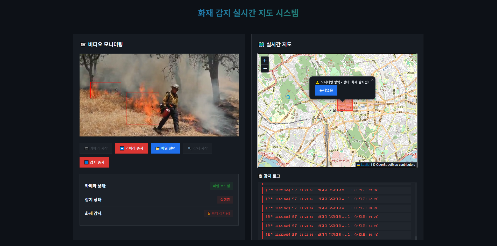

# Fire and Smoke Detection

CNN 모델을 사용해서 실시간(real-time) 스트리밍 영상(RTMP,RSTP)을 통해서 불과 연기를 감지 모니터링 하는 프로젝트입니다.

### OverView

아래 이미지는 시스템이 불과 연기를 감지하기 전과 후의 상태를 명확하게 보여줍니다.

| 감지 전 상태 (Non-detection)                               | 감지 후 상태 (Detection)                               |
| :--------------------------------------------------------- | :------------------------------------------------------- |
|                |                |
| 화재나 연기가 감지되지 않은 **정상 상태**의 비디오 프레임입니다. | 화재 및 연기가 성공적으로 감지되어 **바운딩 박스**로 표시된 비디오 프레임입니다. |

오른쪽 이미지에서 볼 수 있듯이, YOLOv8 모델은 불꽃(`fire`)과 연기(`smoke`)를 정확히 구분하여 사각형 형태로 영역을 표시하고, 해당 객체의 클래스 이름과 신뢰도(%)를 함께 보여줍니다.

## 학습 데이터셋
[Kaggle-Smoke-Fire-Detection-YOLO](https://www.kaggle.com/datasets/sayedgamal99/smoke-fire-detection-yolo/data)

## 평가
- 아래 차트는 학습, 테스트, 검증 세트에 대한 손실, MAP 점수.
<image src='images/results.png'>

- 혼동 행렬
<image src='images/confusion-matrix.png'>

## 결과
<image src='images/val_batch1_labels.jpg'>

## 웹 서버 별 성능

| 서버 구성 | TPS(sec) | response(avg, ms) |
| :---------| -----------:| -----------:|
| 단일 FastAPI | 38.3 |  4618 |

### 테스트 환경
Graphics: NVIDIA RTX A6000
Jmeter 
- **Thread Group**: Thread=200, Ramp up period=10, Duration=60, 
- **Image**: size=(800x544), ext=jpg

### 단일 FastAPI + restApi

> **결과** min=97, max=8294, average=4618, median=5131, std=1310.92, thorughtput=38.3/sec   
> model 처리 시간은 평균적으로 10ms 걸림 

### 전처리 서버 + 추론 서버 + kafka  (추론 서버만 계산, 전처리 서버 tps 600이상)
TPS: 45.65 messages/sec (913 messages in 20 seconds)
GPU 사용량이 낮음(5~20)

### 전처리 서버 + 추론 서버 + kafka + BATCH_SIZE=max(8,16,32) = 32 (추론 서버만 계산, 전처리 서버 tps 600이상)
TPS: 60.4 messages/sec (1208 messages in 20 seconds)
GPU 사용량이 꽤 높음(20 ~ 50) 최대 60% 까지 튐.
